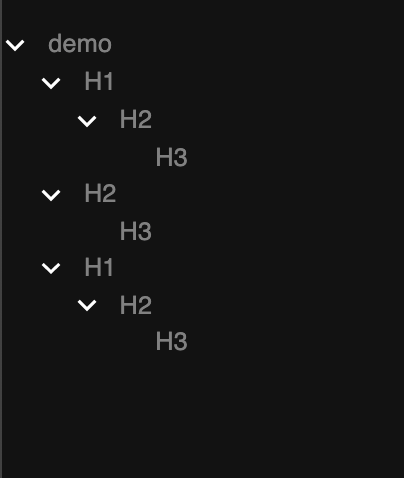

# headings

[](https://github.com/tjmtmmnk/headings/actions/workflows/build.yml)

visualize HTML headings chrome extension

This is result from `demo/demo.html`.



# Project Structure

* src/typescript: TypeScript source files
* src/assets: static files
* dist: Chrome Extension directory
* dist/js: Generated JavaScript files

---
## Setup

```
npm install
```

## Build

```
npm run build
```

## Build in watch mode

### terminal

```
npm run watch
```

### Visual Studio Code

Run watch mode.

type `Ctrl + Shift + B`

## Load extension to chrome

Load `dist` directory

## Test
`npx jest` or `npm run test`
